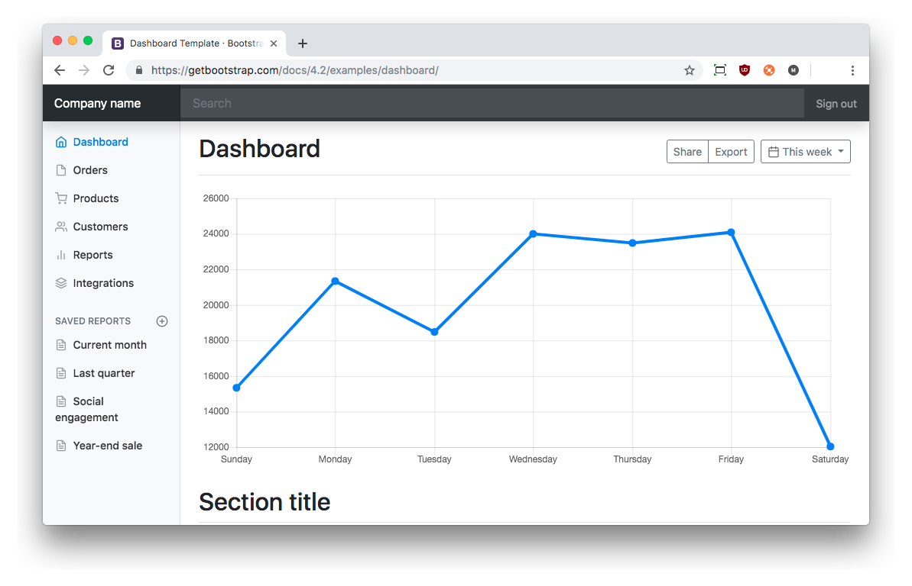
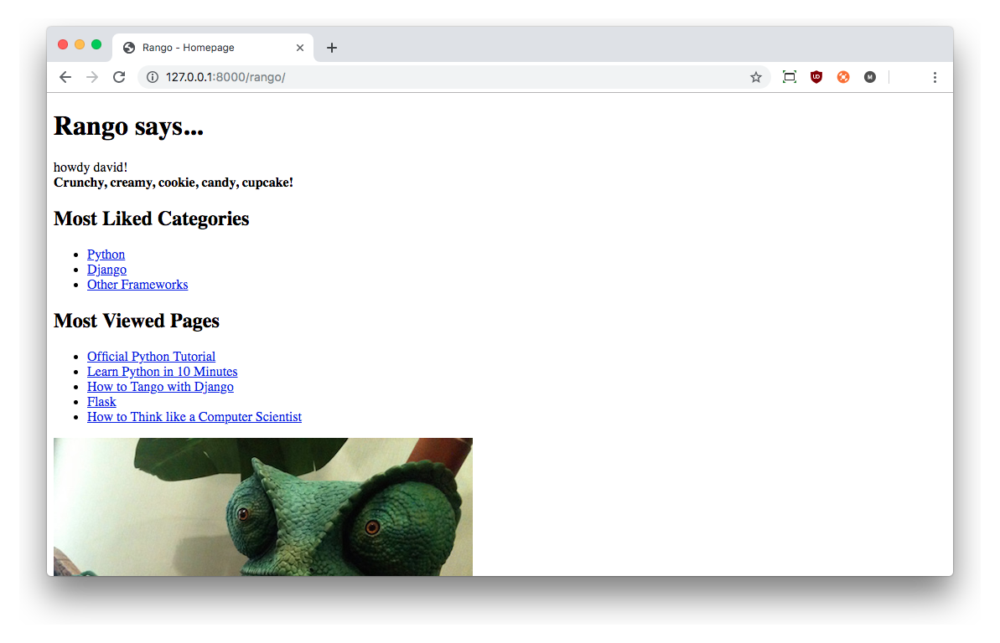
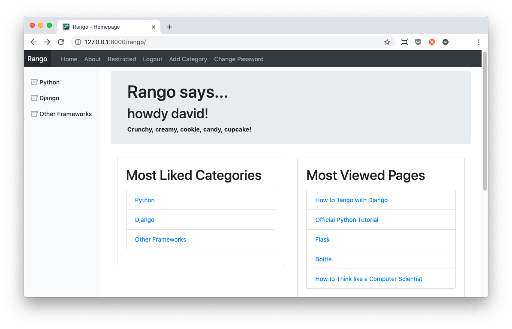
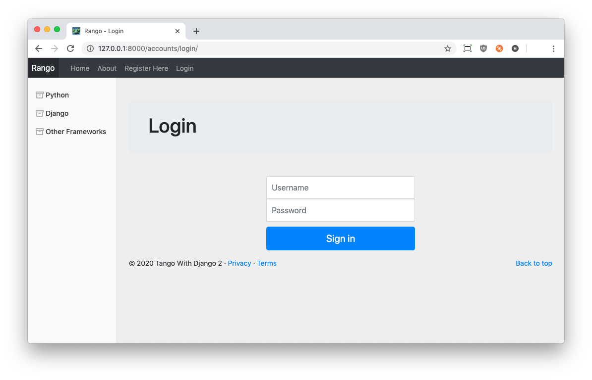
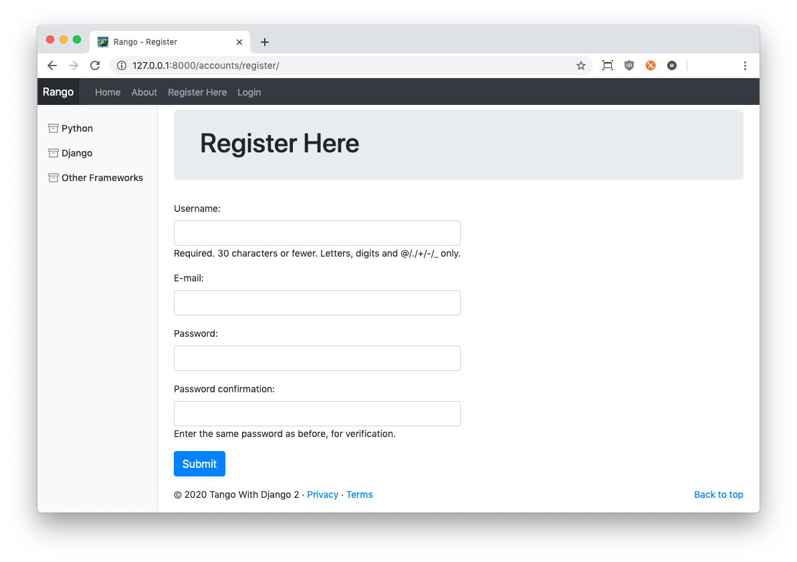

# Bootstrapping Rango {#chapter-bootstrap}
In this chapter, we will be styling Rango using the *Twitter Bootstrap 4* toolkit. Bootstrap is one of the most popular toolkits for styling HTML pages, utilising both CSS and JavaScript (JavaScript is used to provide functionality for user interface components such as menus). The toolkit lets you design and style [*responsive* web applications](https://en.wikipedia.org/wiki/Responsive_web_design), and is pretty easy to use once you familiarise yourself with it.

I> ### Cascading Style Sheets
I> If you are not familiar with CSS, have a look at the [CSS crash course](#chapter-css). We provide a quick guide on the basics of using Cascading Style Sheets.

Now take a look at the [Bootstrap 4.0 website](https://getbootstrap.com/). The website provides you with sample code and examples of the different components that the toolkit provides, and provides you with examples and documentation on how to style them by adding in the appropriate markup and/or code. Besides this, the website also provides several [complete example layouts](https://getbootstrap.com/examples/) from which we can base our styled design for Rango on.

To style Rango, we have identified that the [dashboard layout](https://getbootstrap.com/docs/4.2/examples/dashboard/) more or less meets our needs. The layout provides us with a menu bar at the top, a sidebar (which we will use to show categories), and a main content pane in which we can display page-specific information. You can see the example layout in [the figure below](#fig-bootstrap-dashboard).

{id="fig-bootstrap-dashboard"}

To tailor the dashboard HTML source to our Rango app, we need to make several modifications. Rather than going through and doing this yourself, the modified HTML source is available from our [GitHub Repository](http://bit.ly/twd-bootstrap-base), but for completeness is also shown below.

Download the HTML source for our modified dashboard layout to a file called `bootstrap-base.html`. Like all other templates specific to Rango, this should be placed within your `<Workspace>/tango_with_django_project/templates/rango/` templates directory.

Below is a list of all the different modifications we made to the original dashboard HTML source.

- We replaced all references of `../../` to be `https://getbootstrap.com/docs/4.2/`. The two sets of dots indicates that we want to look back two directory levels back where we currently are in the filesystem (see our [UNIX Crash Course](#section-unix-terminal)). This ensures that we use external files (such as stylesheets and JavaScript files) that are part of Bootstrap 4.2.
- Then, we changed `dashboard.css` to the absolute URL to access this stylesheet and removes any doubt as to what version of the file we are referring to.
- We took out the search form from the *navigation bar* at the top of the page.
- We stripped out all the non-essential demo content from the original HTML page, and replaced it with the Rango `body_block` code -- most importantly including the start and end statements for the `body_block` (``).
- We set the `<title>` element of the page to fit with what we worked on earlier: `<title>How to Tango with Django!</title>`
- We changed `project name` to be `Rango`.
- We added the links to the index page, login page, register page and so forth to the navigation bar at the top.
- We added in a side block from earlier in the tutorial, by adding in a block once more -- ``
- Finally, we added in two Django templating language `load` statements (`` and ``) after the `DOCTYPE` declaration tag to ensure all the necessary imports are present and correct.

We appreciate that this all seems rather hacky -- and to some extent it is -- but the main point of this exercise is to provide a consistent style to the application and learn by experimenting with the CSS. Taking an off-the-shelf example gets us up and running quickly so we can focus on adapting it for use with Rango.

## The Template

W> ### Copying and Pasting
W> In the introductory chapter, we said not to copy and paste -- but this is an exception. 
W> However if you directly cut and paste you will end up bringing additional text you do not want. To get started quickly, go to our GitHub page and get the [base template](http://bit.ly/twd-bootstrap-base) shown below.
W> 
W> If you don't understand what the specific Bootstrap classes do, check out the [Bootstrap documentation](https://getbootstrap.com/docs/4.3/getting-started/introduction/) to improve your understanding.

{lang="html",linenos=on}
	<!DOCTYPE html>
	
	
	
	
	<html lang="en">
	<head>
	    <meta charset="utf-8">
	    <meta name="viewport" 
	          content="width=device-width, initial-scale=1, shrink-to-fit=no">
	    <meta name="description" content="">
	    <meta name="author" 
	          content="Mark Otto, Jacob Thornton, and Bootstrap contributors">
	    <meta name="generator" 
	          content="Jekyll v3.8.5">
	    <link rel="icon" href="">
	    <title>
	        Rango - How to Tango with Django!
	    </title>
	    <!-- Bootstrap core CSS -->
	    <link href="https://getbootstrap.com/docs/4.2/dist/css/bootstrap.min.css" 
	          rel="stylesheet">
	    <!-- Custom styles for this template -->
	    <link href="https://getbootstrap.com/docs/4.2/examples/dashboard/dashboard.css" 
	          rel="stylesheet">
	</head>
	<body>
	<header>
	    <nav class="navbar navbar-expand-md navbar-dark fixed-top bg-dark p-0">
	    <a class="navbar-brand p-2" href="">Rango</a>
	
	    <button class="navbar-toggler" type="button" data-toggle="collapse" 
	        data-target="#navbarCollapse" aria-controls="navbarCollapse" 
	        aria-expanded="false" aria-label="Toggle navigation">
	    
	    </button>
	    

	    <ul class="navbar-nav mr-auto">
	    <li class="nav-item">
	        <a class="nav-link" href="">Home</a></li>
	    <li class="nav-item ">
	        <a class="nav-link" href="">About</a></li>
	    
	    <li class="nav-item ">
	        <a class="nav-link" 
	        href="">Restricted</a></li>
	    <li class="nav-item">
	        <a class="nav-link" 
	        href="">Add Category</a></li>
	    <li class="nav-item">
	        <a class="nav-link" 
	        href="?next=/rango/">Logout</a></li>
	    
	    <li class="nav-item">
	        <a class="nav-link" 
	        href="">Register Here</a></li>
	    <li class="nav-item ">
	        <a class="nav-link" 
	        href="">Login</a></li>
	    
	    </ul>
	    

	    </nav>
	</header>
	
	

	    

	    <nav class="col-md-2 d-none d-md-block bg-light sidebar">
	    

	    
	        
	    
	    

	    </nav> 
	    <main role="main" class="col-md-9  ml-sm-auto col-lg-10 px-4">		
	    
	    
	    <footer>
	        
<a href="#">Back to top</a>

	        
&copy; 2019 Tango With Django 2 &middot; <a href="#">Privacy</a> &middot; 
	            <a href="#">Terms</a>

	    </footer>
	    </main>
	    

	    

	    <!-- Bootstrap core JavaScript -->
	    <!-- Placed at the end of the document so the pages load faster -->
	    
	    
	    
	    
	    
	    </body>
	</html>

Once you have prepared the new `bootstrap_base.html` template, download the [Rango Favicon](https://raw.githubusercontent.com/maxwelld90/tango_with_django_2_code/master/tango_with_django_project/static/images/favicon.ico). This is the small icon that appears next to the URL in your browser! Save this file to `<Workspace>/tango_with_django_project/static/images/`.

If you take a close look at the modified Bootstrap dashboard HTML source, you'll notice it has a lot of structure in it created by a series of `
` tags. Essentially the page is broken into two parts -- the top navigation bar which is contained by `<header>` tags, and the main content pane denoted by the `<main ... >` tag. Within the main content pane, there is a `
` which houses two other `
`s for the `sidebar_block` and the `body_block`.

The code above assumes that you have completed the chapters on user authentication and used `django-registration-redux`, as outlined in the previous chapter. If you haven't done both of these activities, you will need to update the template and remove/modify the references to those links in the navigation bar in the header. 
	
Also of note is that the HTML template makes references to external websites to request the required `css` and `js` files. For everything to work, you will need to be connected to the Internet for the styles and JavaScript files to be loaded when you run Rango.

I> ### Working Offline?
I> Rather than including external references to the `css` and `js` files, you could download all the associated files and store them in your project's `static` directory. We recommend storing CSS files in `static/css/`, with JavaScript files in `static/js/`. If you do this, you will need to update the `bootstrap_base.html` to point to the correct files locally using the `` template function.

## Quick Style Change
To give Rango a much-needed facelift, we need to update our base template to make use of the new `bootstrap-base.html` template. It's now ready to go! There are many ways to do this, with one option being to rename `base.html` to `bootstrap-base.html` in all your other templates. However, a quicker solution would be to do the following.

1. Rename the `base.html` template in `templates/rango/` to `base-old.html`.
2. Rename the `bootstrap-base.html` template in `templates/rango/` to `base.html`.

This ensures you keep a copy of your old `base.html` template and switch the active template that all other Rango templates inherit from to the Bootstrapped version.

T> ### Using `git`?
T> If you are using Git, it would be prudent to use the `git mv` commands in your terminal or Command Prompt to ensure that Git can keep track of these filename changes. If you are using a GUI to manage your Git repository, use that to perform the renaming instead.

Now reload Rango in your browser. You should see a screen that looks similar [to the one below](#fig-bootstrap-initial).

{id="fig-bootstrap-initial"}

Have a look through the different pages of your app. Since they all inherit from `base.html`, they will all now employ the Bootstrap dashboard layout. However, they aren't perfect yet! In the remainder of this chapter, we will go through several changes to the templates, and use various Bootstrap components to improve the look and feel of Rango further. But to remind yourself of what Rango looked like before, compare and contrast to [the figure below](#fig-bootstrap-initial-nostyling)!

{id="fig-bootstrap-initial-nostyling"}

<!--
## Page Headers
Now that we have the `base.html` all set up and ready to go, we can do a
really quick face lift to Rango by going through the Bootstrap
components and selecting the ones that suit the pages.

Let's start by updating all our templates by adding in the class `page-header` to the `<h1>` title tag at the top of each page. For example the `about.html` would be updated as follows.

{lang="html",linenos=off}
	
	
	
		About
	
	
	
		

		<h1 class="page-header">About Page</h1>			
			This tutorial has been put together by: leifos and maxwelld90 
		
	
		 
	

This doesn't visually appear to change the look and feel, but it informs the toolkit what is the title text, and if we change the theme then it will be styled appropriately.

-->

### Sidebar Categories
One thing that we could improve is the way that the categories on the sidebar to the left appear. They look pretty basic at the moment, so let's make them look nicer! If we first take a look at the HTML source code for the example [Bootstrap dashboard page](https://getbootstrap.com/docs/4.2/examples/dashboard/), we notice that a few [*classes*](https://www.w3schools.com/cssref/sel_class.asp) have been added to the `<ul>` *(unordered list)* and `<li>` *(list item)* tags to denote that they are navigation items (`nav-item`) and navigation links (`nav-link`) respectively.

Let's apply these classes to our `rango/categories.html` template. Refactor the file to look like the example below. Note that the logic and basic structure stays the same -- we just add classes and some supplementary tags to make things look nicer.

{lang="html",linenos=on}
	<ul class="nav flex-column">
	
	    
	    
	        <li class="nav-item">
	        <a class="nav-link active" href="">
	            {{ c.name }}
	        </a>
	        </li>
	    
	        <li class="nav-item">
	        <a class="nav-link" href="">
	        {{ c.name }}
	        </a>
	        </li>
	    
	    
	
	    <li class="nav-item">There are no categories present.</li>
	
	</ul>

Rather than using `<strong>` to show what category page has been selected, we have added the `active` class to the currently shown category. We can also add in a `feather-icon` using the `` tag. Here, we chose the `archive` icon, but there are loads of icons you can choose from instead. Have a look at the [Feather Icons website](https://feathericons.com/) for a list.

### The Index Page
For the index page, it would be nice to show the top categories and top pages in two separate columns, with the title kept at the top. This would be a much better use of your screen's real estate!

If we go back to the Bootstrap examples, we can see that [Jumbotron](https://getbootstrap.com/docs/4.2/examples/jumbotron/) example provides a neat header element that we can put our title message in. To use that, we update our `index.html` template to incorporate the following, replacing the existing header message markup (including the existing `<h1>` tag and corresponding `
` immediately underneath).
 
{lang="html",linenos=off}
	

	    

	        <h1 class="jumbotron-heading">Rango says...</h1>
	        

	        <h2 class="h2">
	            
	                howdy {{ user.username }}!
	            
	                hey there partner!
	            
	        </h2>
	        <strong>{{ boldmessage }}</strong>
	        

	    

	

For the `
` container, we applied classes `jumbotron` and `p-4`. The class `p-4` controls the [spacing](https://getbootstrap.com/docs/4.2/utilities/spacing/) around the jumbotron. Try changing the padding to be `p-6` or `p-1` to see what happens! You can also control the space of the top, bottom, left and right by specifically setting `pt`, `pb`, `pr` and `pl` instead of just `p`. 

X> ### Site Styling Exercise
X> Update all other templates so that the page heading is encapsulated within a jumbotron. This will make the whole application have a consistent look, something crucial for a professionally-designed website.
X>
X> Don't forget to update the templates used for the `registration` package!

After you have successfully added the jumbotron, we can move on to the two-column layout. Here, we draw upon the [album](https://getbootstrap.com/docs/4.2/examples/album/) layout. While it has three columns, called cards, we only need two. Most -- if not all -- CSS frameworks use a [grid layout](https://getbootstrap.com/docs/4.2/layout/grid/) consisting of a total of 12 columns. If you inspect the HTML source for the album layout, you will see that within a row there is a `
` which sets the size of the cards. The `
` is `
`, followed by `
`. This sets each card to be 4 units in length (out of 12) relative to the width (and 4 by 3 is 12). Since we want two cards (one for the most popular pages and most popular categories) then we can change the 4 to a 6 (i.e. 50%, with 2 by 6 is 12). To implement this, update the `index.html` template once again. This time, we are replacing the existing `
` elements that housed the most liked categories and most viewed pages.
 
{lang="html",linenos=off}
	

	    

	        

	            

	                

	                    <h2>Most Liked Categories</h2>
	                    

	                    
	                    <ul>
	                        
	                        <li>
	                        <a href="">
	                        {{ category.name }}</a>
	                        </li>
	                        
	                    </ul>
	                    
	                    <strong>There are no categories present.</strong>
	                    
	                    

	                

	            

	        

	        
	        

	            

	                

	                    <h2>Most Viewed Pages</h2>
	                    

	                    
	                    <ul>
	                        
	                        <li>
	                        <a href="{{ page.url }}">{{ page.title }}</a>
	                        </li>
	                        
	                    </ul>
	                    
	                    <strong>There are no pages present.</strong>
	                    
	                    

	                

	            

	        

	    

	

 
Once you have updated the template, reload the page -- it should look a lot better now, but the way the list items are presented is not the best. Once again, it looks pretty basic. Surely we can make it look even better!

Let's use the [list group styles provided by Bootstrap](https://getbootstrap.com/docs/4.2/components/list-group/) to improve how the hyperlinks are presented. We can do this quite easily by changing the two `<ul>` elements to `<ul class="list-group">` and each of the `<li>` elements that we just added to include a class, `<li class="list-group-item">`. Once you have completed these steps, reload the index page. How does it look now? It should look similar to [the figure below](#fig-bootstrap-styled-index).

{id="fig-bootstrap-styled-index"}

### The Login Page
Now that the index page has been styled, let's turn our attention to Rango's login page. On the Bootstrap website, there is a demonstration [login form](https://getbootstrap.com/docs/4.2/examples/sign-in/). If you take a look at the source, you'll notice that there are several classes that we need to include to get a basic login form to work using Bootstrap. To do this, we can start by replacing the `body_block` in the `registration/login.html` template with the following code.

{lang="html",linenos=off}
	
	<link href="https://getbootstrap.com/docs/4.0/examples/signin/signin.css"
		rel="stylesheet">
	

		<h1 class="jumbotron-heading">Login</h1>
	

	

	<form class="form-signin" role="form" method="post" action=".">
		
		<label for="inputUsername" class="sr-only">Username</label>
		<input type="text" name="username" id="id_username" class="form-control" 
			placeholder="Username" required autofocus>
		<label for="inputPassword" class="sr-only">Password</label>
		<input type="password" name="password" id="id_password" class="form-control"
			placeholder="Password" required>
		<button class="btn btn-lg btn-primary btn-block" type="submit" 
			value="Submit">Sign in</button>
	</form>
	

	

Besides adding in a link to the bootstrap `signin.css` and a series of changes to the classes associated with elements, we have removed the code that automatically generates the login form (`{{ form.as_p }}`). Instead, we took the elements from the generated `<form>`, and importantly the `name` of the form elements. We then associated the names with the new elements we added above. To find out what the `name`s were, we ran Rango, navigated to the login page, and then inspected the source to see what HTML was produced by the `{{ form.as_p }}` call. 

In the button, we have set the classes to `btn` and `btn-primary`. If you check out the [Bootstrap section on buttons](https://getbootstrap.com/docs/4.2/components/buttons/), you can see there are lots of different colours, sizes and styles that can be assigned to buttons. The resultant output can be see in [the figure below](#fig-bootstrap-style-login).

{id="fig-bootstrap-style-login"}

### Other Form-based Templates
You can apply similar changes to `add_cagegory.html` and `add_page.html` templates. For the `add_page.html` template, we can set it up as follows.

{lang="html",linenos=off}
	
	Add Page
	
	    
	    

	        

	        <h1 class="jumbotron-heading">Add Page to {{category.name}}</h1>
	        

	    

	    

	        

	        <form role="form" id="page_form" method="post" 
	              action="">
	        
	        
	            {{ hidden }}
	        
	        
	            {{ field.errors }}
	            {{ field.help_text }} 
	            {{ field }} 
	            

	        
	         
	        <button class="btn btn-primary" type="submit" name="submit">
	            Add Page
	        </button>
	        

	        </form>
	        

	    

	    
	    

	        

	            <h1 class="jumotron-heading">Add a Page</h1>
	        

	    

	    

	        The specified category does not exist.
	    

	    
	

X> ### Category Form Style Exercise
X> Create a similar template for the *Add Category* template, located at `rango/add_category.html`.

###The Registration Template
Finally, let's tweak the registration template. Open the registration form template, located at `templates/registration/registration_form.html`. Once you have the file open, we can update the markup inside the `body_block` as follows. Make sure you keep the existing jumbotron you added earlier as part of an exercise!

{lang="python",linenos=off}
	

	    

	    

	    <form role="form"  method="post" action=".">
	        
	        

	        
<label class="required" for="id_username">
	            Username:</label>
	        <input class="form-control" id="id_username" maxlength="30"
	            name="username" type="text" />
	        
	            Required. 30 characters or fewer.
	            Letters, digits and @/./+/-/_ only.
	        
	        

	        
<label class="required" for="id_email">
	            E-mail:</label>
	        <input class="form-control" id="id_email" name="email" 
	            type="email" />
	        

	        
<label class="required" for="id_password1">
	            Password:</label>
	        <input class="form-control" id="id_password1" name="password1"
	            type="password" />
	        

	        

	        <label class="required" for="id_password2">
	            Password confirmation:</label>
	        <input class="form-control" id="id_password2" name="password2" 
	            type="password" />
	        
	            Enter the same password as before, for verification.
	        
	        

	        

	        <button type="submit" class="btn btn-primary">Submit</button>
	    </form>
	    

	

	

Once again, we have transformed the form created by the `{{ form.as_p }}` method call, and added the various bootstrap classes to the manual form.

W> ### Bootstrap, HTML and Django Kludge
W> This is not the best solution -- we have kind of mushed things together.
W> It would be much nicer and cleaner if we could instruct Django when building the HTML for the form to insert the appropriate classes. But we will leave that to you to figure out! Toolkits do exist, so perhaps there is a solution that automatically handles everything for you!
W> Nevertheless, by manually bringing everything together, you can obtain a better appreciation and understanding of how the different components fit together.

### Next Steps
This chapter has described how to quickly style your Django application using the Bootstrap toolkit. Bootstrap is highly extensible and it is relatively easy to change themes -- check out the [StartBootstrap website](http://startbootstrap.com/) for a whole series of free themes. Alternatively, you might want to use a different CSS toolkit like: [Zurb](http://zurb.com), [Pure](https://purecss.io) or [GroundWorkd](https://groundworkcss.github.io/groundwork/). Now that you have an idea of how to hack the templates and set them up to use a responsive CSS toolkit, we can now go back and focus on finishing off the extra functionality that will pull the application together.

X> ### Another Style Exercise
X> While this tutorial uses Bootstrap, an additional, and optional exercise, would be to style Rango using one of the other responsive CSS toolkits. If you do create your style, let us know and we can link to it to show others how you have improved Rango's styling!